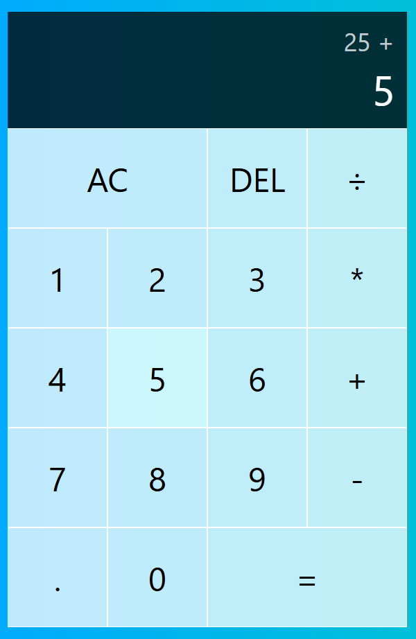

# This project followed a React Tutorial from Web Dev Simplified

This project followed very heavily with the tutorial made by a creator under the username "[Web Dev Simplified](https://www.youtube.com/@WebDevSimplified)" on YouTube.\
The YouTube video for the tutorial is called "[The Perfect Beginner React Project](https://www.youtube.com/watch?v=DgRrrOt0Vr8)".

The application is hosted on GitHub Pages and can be accessed here: https://swasbuckler.github.io/my-calculator-app.

## What have I Achieved and Learnt through this Project

Although this project was at a beginner level and I had followed very closely to the code presented by Web Dev Simplified, it had allowed me gain a good understanding on React's Reducer through making a viable calculator application.\
I hope to take this knowledge and apply it in future React projects.

## Screenshots of the Application

### Calculator

